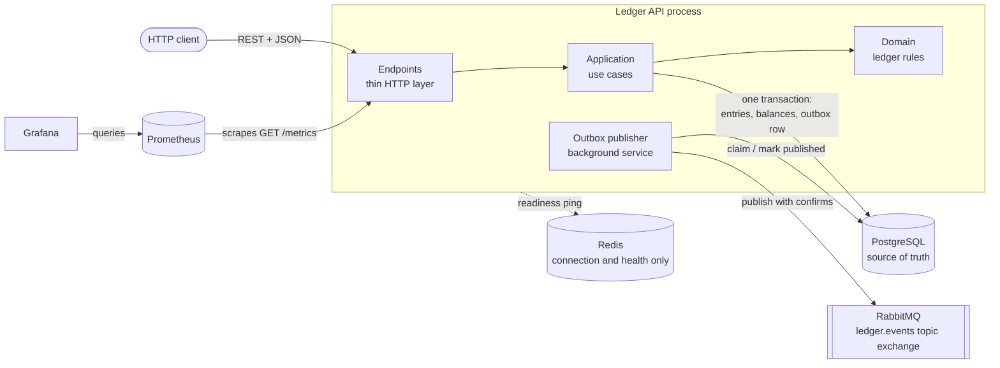
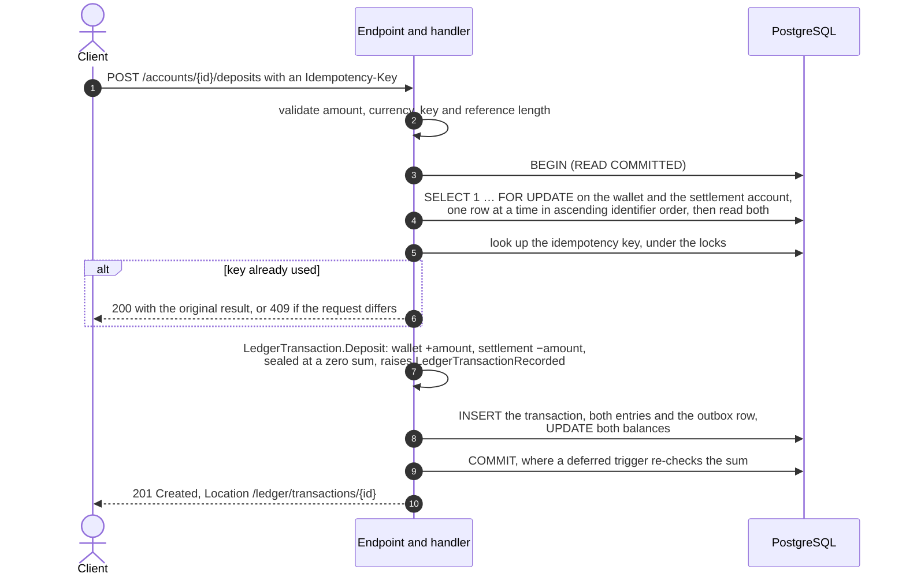

# ledger-core

A double-entry **ledger and wallet service** in C# and .NET 8. It records deposits,
withdrawals, transfers and reversals as balanced ledger transactions in PostgreSQL.
It stays correct under concurrent requests, crashes and retries, and it publishes an
event for every transaction through a transactional outbox.

The HTTP surface is deliberately small. The substance is in the parts money
systems most often get wrong: atomicity, locking, idempotency and delivery
semantics, and in the evidence that they hold, from automated tests, load tests and
deliberately broken infrastructure.

**Status:** complete for its intended scope, run locally with Docker Compose, not
deployed anywhere. See [Project status and licence](#project-status-and-licence).

## Contents

- **The system:** [Why it exists](#why-it-exists) · [Core guarantees](#core-guarantees) · [Architecture](#architecture) · [Technology stack](#technology-stack) · [Domain model](#domain-model) · [Double-entry bookkeeping](#double-entry-bookkeeping) · [How a deposit flows](#how-a-deposit-flows)
- **How it stays correct:** [Concurrency](#concurrency) · [Idempotency](#idempotency) · [Transactional outbox](#transactional-outbox) · [RabbitMQ delivery semantics](#rabbitmq-delivery-semantics) · [Redis: what it does and does not do](#redis-what-it-does-and-does-not-do)
- **Operating it:** [Observability](#observability) · [Health and readiness](#health-and-readiness) · [Performance](#performance) · [Testing strategy](#testing-strategy)
- **Running it:** [Local development](#local-development) · [Running with Docker Compose](#running-with-docker-compose) · [Running the tests](#running-the-tests) · [Running the load tests](#running-the-load-tests) · [Database migrations](#database-migrations) · [Configuration](#configuration) · [API examples](#api-examples)
- **Judgement and limits:** [Failure and recovery](#failure-and-recovery) · [Architectural decisions](#architectural-decisions) · [Known limitations](#known-limitations) · [Future work](#future-work) · [Project status and licence](#project-status-and-licence)

Detailed documents:

| Document | What it covers |
|---|---|
| [docs/ARCHITECTURE.md](docs/ARCHITECTURE.md) | Diagrams: system context, layers, deposit, transfer, outbox publishing, lock ordering |
| [docs/DOMAIN.md](docs/DOMAIN.md) | Accounts, money, ledger transactions and entries, and every invariant |
| [docs/CONCURRENCY.md](docs/CONCURRENCY.md) | Transactions, row locks, lock ordering, contention, with measurements |
| [docs/FAILURES.md](docs/FAILURES.md) | Twelve failure scenarios: what breaks, what survives, what is safe to retry |
| [docs/API.md](docs/API.md) | Every endpoint, with real requests and responses |
| [docs/PERFORMANCE.md](docs/PERFORMANCE.md) | Load tests, the bottleneck, optimisations kept and rejected |
| [docs/DECISIONS.md](docs/DECISIONS.md) | Architecture decision records, ADR-001 to ADR-011 |

## Why it exists

Moving a number from one row to another is easy. Doing it so the number is right
after two requests race, a client retries a timeout, or the process dies between
two writes is the actual problem. Each of those has a well-known failure:

- **The race.** Two withdrawals both read a balance of 40, both decide 25 is
  affordable, and the wallet ends at −10.
- **The retry.** A client that retries a timed-out payment is charged twice.
- **The crash.** A service that commits and then publishes an event loses the event
  when it crashes in between. One that publishes first announces money that never
  moved.

This project answers each with a specific mechanism, a test that proves it, and,
where it matters, a measurement of what it costs. It exists to show that reasoning
end to end, in code a reviewer can run.

It deliberately has no UI, no authentication, no currency exchange and no
multi-tenancy. Those would add surface without adding to the demonstration, and
their absence is listed under [Known limitations](#known-limitations).

## Core guarantees

What the code enforces, how, and where the proof is:

| Guarantee | Enforced by | Proven by |
|---|---|---|
| Every ledger transaction balances: at least two entries that sum to zero | The `LedgerTransaction` aggregate seals itself; a deferred constraint trigger re-checks at `COMMIT` | Domain tests, `LedgerConstraintTests`, invariant checks after every load run |
| A balance changes only through entries that explain it, and always equals their sum | `Account.Credit`/`Debit` are `internal` to the domain and called only by the aggregate; balance and entries are written in one transaction | Invariant "stored balance equals sum of entries" |
| Entries are never modified or deleted | A trigger rejects `UPDATE` and `DELETE` on `ledger_entries` | `LedgerConstraintTests` |
| A wallet never goes negative (system accounts may) | Checked on a balance read under a row lock; a check constraint as backstop | `LedgerConcurrencyTests` |
| Amounts in different currencies are never combined | `Money` refuses; composite foreign keys tie each entry's currency to its account and transaction | Domain tests, `LedgerConstraintTests` |
| Concurrent requests can neither overdraw a wallet nor deadlock | `SELECT … FOR UPDATE` on every affected account, in ascending identifier order, before any balance is read | `LedgerConcurrencyTests`; zero deadlocks recorded in Phase 6 at up to 200 concurrent clients |
| A retry with the same `Idempotency-Key` moves money once; a key reused for a different request is refused | Key looked up after the locks are held; request fingerprint compared; partial unique index as backstop | Handler and concurrency tests; an API killed mid-traffic and retried (FAILURES.md, section 5) |
| A transaction is reversed at most once, and a reversal cannot be reversed | Checked under the locks; partial unique index on the reversed transaction | Domain, handler and persistence tests |
| Every committed transaction has exactly one outbox message, committed with it | The outbox row is inserted in the same database transaction as the money | `OutboxTests`; invariant "every transaction has exactly one outbox message" |
| Every outbox message is published at least once, once the broker accepts it | Claim with lease, publisher confirms, mark published, retry with backoff | `OutboxTests`; broker outage under load lost nothing (PERFORMANCE.md, section 11) |

And what it does **not** guarantee:

- **Exactly-once delivery.** A message can be delivered twice, and consumers must
  de-duplicate on `MessageId`.
- **Safe retries without identification.** A retried money movement that carries
  neither an `Idempotency-Key` nor a client-chosen `transactionId` can move money
  twice.
- **Memory of refusals.** A refused request is evaluated again from scratch if it is
  retried.
- **Service without PostgreSQL.** PostgreSQL is the only dependency the API cannot
  run without.
- **Any security boundary.** There is no authentication (see
  [Known limitations](#known-limitations)).

## Architecture



Four projects, with dependencies pointing inwards:

```text
Ledger.Api             composition root: endpoints, error contract, observability, OpenAPI
Ledger.Infrastructure  EF Core + PostgreSQL, repositories, unit of work, outbox, RabbitMQ, Redis
Ledger.Application     use cases, the interfaces they need, validation, ledger telemetry
Ledger.Domain          Account, Money, LedgerTransaction, LedgerEntry: no references at all
```

- **The domain depends on nothing.** A change to the database, the ORM or the web
  framework cannot alter a ledger rule, and the rules are tested in milliseconds.
- **The application layer declares its own interfaces** (`IAccountRepository`,
  `ILedgerTransactionRepository`, `IUnitOfWork`). Infrastructure implements them
  with `internal` classes, so no EF Core type is visible outside that project.
- **Handlers are plain classes called directly by the endpoints.** There is no
  mediator, no generic repository and no mapping library.

What each piece of state is:

| Kind | What | Where |
|---|---|---|
| **Source of truth** | Ledger entries (the history) and ledger transactions | PostgreSQL `ledger_entries`, `ledger_transactions` |
| **Derived state** | Account balances, materialised and written in the same transaction as their entries | PostgreSQL `accounts.balance_amount` |
| **Durable intent** | Events waiting to be published, committed with the money | PostgreSQL `outbox_messages` |
| **Asynchronous infrastructure** | Events on the broker, delivered at least once, never authoritative | RabbitMQ `ledger.events` |
| **Observability** | Logs, traces, metrics | stdout, `/metrics`, Prometheus, Grafana |
| **Provisioned, unused** | Nothing is stored | Redis |

Diagrams for every flow are in [docs/ARCHITECTURE.md](docs/ARCHITECTURE.md).

```text
src/        Ledger.Domain, Ledger.Application, Ledger.Infrastructure, Ledger.Api
tests/      one test project per source project
docs/       architecture, domain, concurrency, failures, API, performance, decisions
deploy/     Prometheus configuration, Grafana provisioning and dashboard, PostgreSQL init script
load-tests/ k6 scenarios, SQL diagnostics and invariant checks, measurement tooling
```

## Technology stack

| Area | Choice |
|---|---|
| Runtime | .NET 8 (SDK pinned in `global.json`), ASP.NET Core minimal APIs |
| Persistence | PostgreSQL 16, EF Core 8.0.11 with Npgsql |
| Messaging | RabbitMQ 3.13, RabbitMQ.Client 6.8.1, publisher confirms |
| Cache infrastructure | Redis 7, StackExchange.Redis 2.8.16 (connected, unused; see [Redis](#redis-what-it-does-and-does-not-do)) |
| Logging | Serilog, compact JSON to stdout |
| Traces and metrics | OpenTelemetry 1.9 (ASP.NET Core, HttpClient, Npgsql, runtime) with the Prometheus exporter |
| Dashboards | Prometheus 2.55, Grafana 11.3, both provisioned from files |
| API description | OpenAPI through Swashbuckle 6.9, with Swagger UI |
| Tests | xUnit, Testcontainers (PostgreSQL, RabbitMQ, Redis), `WebApplicationFactory` |
| Load tests | k6 0.54, run in a container on the Compose network |
| Delivery | Multi-stage Alpine Docker image running as a non-root user, Docker Compose, GitHub Actions |

Exact package versions are in the project files; the versions used for the
performance measurements are recorded in PERFORMANCE.md, section 2.

## Domain model

- **Currency.** USD, EUR or IRR, stored as the ISO 4217 alphabetic code, never as an
  enum ordinal.
- **Money.** An exact `decimal` amount in one currency. It refuses to combine
  currencies, and refuses more decimal places than the currency has.
- **Account.** Either a **wallet**, holding a customer's money and never negative, or
  a **system** account, the ledger's counterparty with the outside world, which may
  be negative.
- **Settlement accounts.** One system account per currency (`SETTLEMENT:USD`, …),
  seeded by migration. Every deposit and withdrawal moves money against it.
- **LedgerTransaction.** The aggregate, and the only thing that can change a
  balance. Its kinds are `Deposit`, `Withdrawal`, `Transfer` and `Reversal`.
- **LedgerEntry.** One signed amount on one account. Immutable.

Every rule, and where each one is enforced, is in
[docs/DOMAIN.md](docs/DOMAIN.md).

## Double-entry bookkeeping

Every movement is recorded as entries on at least two accounts, and each
transaction's entries sum to zero. A positive entry increases an account's balance
and a negative one decreases it.

| Operation | Entries | Sum |
|---|---|---|
| Deposit 100.00 USD into wallet W | W **+100.00**, SETTLEMENT:USD **−100.00** | 0 |
| Withdraw 10.00 USD from W | W **−10.00**, SETTLEMENT:USD **+10.00** | 0 |
| Transfer 30.00 USD from W to V | W **−30.00**, V **+30.00** | 0 |
| Reverse that transfer | a *new* transaction: W **+30.00**, V **−30.00** | 0 |

A deposit is not "add 100 to the wallet". Money cannot appear from nothing, so it
comes from the settlement account.
- **The settlement account's balance:** negative, and that is not an error. It is
  how much value the platform has taken in, the figure reconciled against the real
  bank rail.
- **The ledger as a whole:** because every transaction sums to zero, it sums to zero
  in every currency.
- **Where that is checked:** after the integration tests, and after every load run.

A reversal never edits or deletes the original. It records a compensating
transaction, so the history of what happened, and of its correction, is complete.

## How a deposit flows



The ledger rows, both balances and the outbox row commit together or not at all.
Publishing the event happens later, in the background. The transfer, outbox
publishing and lock-ordering diagrams are in
[docs/ARCHITECTURE.md](docs/ARCHITECTURE.md).

## Concurrency

- **One transaction per operation.** Every money movement runs in one explicit
  PostgreSQL transaction at READ COMMITTED.
- **Lock, then read.** Before reading any balance, the operation locks every account
  it will change with `SELECT … FOR UPDATE`, then reads the locked rows. A decision
  is never made on a balance another transaction could still change.
- **One global lock order.** Locks are taken one row at a time in ascending
  identifier order, whatever order the request named the accounts in. A transfer
  from A to B and one from B to A therefore queue instead of deadlocking.
  Deadlocks are impossible by construction, and Phase 6 recorded none.
- **Why not SERIALIZABLE.** It would add a retry loop to every operation to protect
  against anomalies that cannot occur when every row a decision depends on is
  locked first.

The price is contention. Every deposit and withdrawal in a currency locks that
currency's single settlement account, so they run one at a time. That row is the
measured write ceiling: about 165 deposits a second per currency on the reference
laptop. It is an accepted trade-off (ADR-010).

Locking the settlement row *last* was tried and rejected: deposits were 19.9 %
slower, and latency became far less fair. Removing two unnecessary round trips from
inside the locked window was kept: +13 % at 50 clients.
[docs/CONCURRENCY.md](docs/CONCURRENCY.md) has the reasoning and the numbers.

## Idempotency

Every money endpoint accepts an optional `Idempotency-Key` header (at most 200
characters).

| Situation | Result |
|---|---|
| Retry with the same key, after the first attempt committed | **200** with the original transaction and `"wasReplayed": true` |
| Same key sent concurrently | One **201**; the others wait on the same row locks, then **200** |
| Same key, but a different amount, currency, wallet, direction or operation | **409** Conflict |
| Same key after the first attempt was refused | Evaluated again: refusals are not remembered |
| No key, but the same `transactionId` in the body | **409**: the identifier already exists, so no second movement |
| No key and no `transactionId` | A new movement every time |

- **Where the check happens.** The key is checked inside the transaction that moves
  the money, after the locks are held, so two attempts cannot both miss each other.
- **The backstop.** A partial unique index on the key refuses a second insert if
  the check were ever bypassed.
- **Keys are global.** They never expire and are not scoped to a client, because
  there are no clients to scope them to.

The full case list is in [docs/FAILURES.md](docs/FAILURES.md), section 8, and the
decision and its Phase 7 amendment in ADR-007.

## Transactional outbox

Committing the money and then publishing to a broker is a dual write with no
correct failure mode. So the event is written **into the same transaction as the
money**, as a row in `outbox_messages`, and a background publisher moves it to
RabbitMQ afterwards:

1. **Claim** up to 50 due messages in `id` order with `FOR UPDATE SKIP LOCKED`,
   adding one to each one's attempt count and leasing it for 60 s. The claim
   commits immediately, so no database transaction stays open while the broker is
   contacted.
2. **Publish** each message and wait for the broker's confirmation (10 s at most).
3. **Mark** it published, and only after the confirmation.
4. **On failure**, record the error and schedule the next attempt 2^attempts
   seconds later (at most 300 s). Stop the batch, because if the broker is down the
   rest would fail too.

A broker outage is not a financial outage. Money keeps moving, messages accumulate,
and the backlog drains when the broker returns. In Phase 6, 50 clients kept
depositing through a broker outage without a single failed request, and every
message was delivered afterwards. Several API instances can publish from the same
table safely.

## RabbitMQ delivery semantics

| Property | Value |
|---|---|
| Exchange | `ledger.events`, topic, durable |
| Routing key and message type | `ledger.transaction.recorded.v1` |
| Message identifier | `MessageId` = the ledger transaction identifier, stable across republication |
| Persistence | delivery mode 2 (persistent); publisher confirms on every message |
| Payload | `{"MessageId","TransactionId","Kind","Currency","OccurredAt"}`: **no amounts, no balances** |

- **Delivery is at-least-once. Exactly-once is not claimed.** If the process dies
  after the broker confirms a message but before the row is marked, the message is
  published again when its lease expires. The broker and the database cannot commit
  together, so that window cannot be closed; consumers must de-duplicate on
  `MessageId`.
- **Ordering is not guaranteed.** A message that failed is retried after its
  backoff, while later messages may already have been published.
- **Nothing in this repository consumes the events.** With no queue bound, the topic
  exchange confirms each message and discards it, so a consumer binds its own
  durable queue.
- **Measured.** Under load, an audit queue received 16,339 messages for 16,338
  published: none lost, one legitimate duplicate (PERFORMANCE.md, section 11).

## Redis: what it does and does not do

**What it does.** Redis is provisioned in Compose, connected at start-up when
`Redis__ConnectionString` is set, and health-checked. Its readiness check reports
`Degraded` (still HTTP 200) when Redis is unreachable.

**What it does not do.** No code reads or writes it:
- no balance cache;
- no idempotency keys;
- no distributed locks;
- no sessions;
- no rate limiting.

It runs without persistence, and the service starts and serves normally without
it.

That is deliberate. The idempotency check has to be atomic with the money movement,
which only the database transaction provides, and a cached balance would become a
second, weaker source of truth. Redis is there so a future feature with a
legitimate need, such as rate limiting, has the infrastructure ready (ADR-011).
Nothing of the kind is built.

## Observability

All three signals share the W3C trace identifier ASP.NET Core creates for each
request:

| Signal | Implementation | Destination |
|---|---|---|
| Logs | Serilog, compact JSON; one line per request with method, path, status and duration | stdout |
| Traces | OpenTelemetry spans for HTTP, ledger operations and each PostgreSQL command | Console in Development; no trace backend is part of the stack |
| Metrics | OpenTelemetry, exported in Prometheus format | `GET /metrics`, scraped by Prometheus, shown in Grafana's provisioned **Ledger Service** dashboard |

The identifier comes back in the `trace-id` response header and in the `traceId`
field of every error response, and it appears on every log event. A caller can
quote one value and find the request in all three.

Ledger metrics (Prometheus names):

| Metric | Type | Labels |
|---|---|---|
| `ledger_transactions_total` | counter | `ledger_operation`, `ledger_currency`, `ledger_outcome` |
| `ledger_transaction_failures_total` | counter | `ledger_operation`, `ledger_failure_reason` |
| `ledger_transaction_duration_seconds` | histogram | `ledger_operation`, `ledger_outcome` |
| `ledger_accounts_opened_total` | counter | `ledger_currency` |
| `ledger_outbox_published_total` | counter | none |
| `ledger_outbox_publish_failures_total` | counter | none (appears after the first failure) |
| `ledger_outbox_pending` | gauge | none |

These sit alongside standard HTTP server, Npgsql connection-pool and .NET runtime
metrics.

**What is kept out of telemetry.**
- **No high-cardinality labels.** No metric carries an account identifier, a
  transaction identifier or an idempotency key, and every label comes from a closed
  set: an unrecognised currency becomes `unknown`.
- **Identifiers only where needed.** Spans carry account and transaction
  identifiers, because that is how a specific failure is found. Request log lines
  contain paths, and paths contain account identifiers.
- **No amounts.** Neither metrics nor logs carry amounts or balances. ADR-008 has
  the reasoning.

## Health and readiness

| Endpoint | Checks | Returns |
|---|---|---|
| `GET /health/live` | **Nothing external** | 200 whenever the process can serve HTTP |
| `GET /health/ready` | PostgreSQL, RabbitMQ, Redis | **200** `Healthy`; **200** `Degraded` if only RabbitMQ or Redis is down; **503** `Unhealthy` if PostgreSQL is down |

- **Liveness never looks at the database.** A database outage must not make an
  orchestrator restart every instance into a crash loop.
- **Readiness separates needs from uses.** PostgreSQL is needed; RabbitMQ and Redis
  are merely used, and an instance without them still moves money correctly.
- **The response carries names and statuses only**, for example
  `{"status":"Degraded","checks":{"postgres":"Healthy","rabbitmq":"Degraded","redis":"Healthy"}}`.
  The default writer would have included exception messages, which for a database
  check can contain hosts and credentials.

## Performance

Measured in Phase 6 with k6 on a single laptop running the API, PostgreSQL,
RabbitMQ, Redis, Prometheus, Grafana and the load generator at once. These are
comparisons on one machine, not capacity figures or service-level objectives.

| Scenario, final code | Clients | Throughput | p99 latency |
|---|---:|---:|---:|
| Reads (account and statement) | 50 | 6,437 req/s | 19 ms |
| Deposits, one currency | 50 | 165 req/s | about 800 ms |
| Deposits, one currency | 200 | 151 req/s | not quoted |
| Transfers across 200 wallets | 50 | about 880 req/s | about 170 ms |
| Mixed traffic | 50 | about 790 req/s | not quoted |

The p99 column quotes only the latencies PERFORMANCE.md's summary states.

- **The bottleneck is the settlement row.** 97.1 % of all statement time in the
  baseline was spent waiting to lock it. Splitting deposits across two currencies,
  and so two rows, gave 1.9 times the throughput. PostgreSQL was not short of CPU or
  disk on that path.
- **Kept.** An index matching the outbox claim, which made each claim about 100
  times cheaper (110 ms → 1.1 ms). Disabling EF Core's per-save savepoint: deposits
  +13 % at 50 clients and +28 % at 200.
- **Rejected.** Locking the settlement account last (deposits −19.9 %). Capping the
  connection pool at 40 (no throughput change, deposit p99 doubled).
- **Correctness under load.** Zero deadlocks; ten ledger invariants with zero
  violations after every stack, including runs killed mid-flight; idempotency held;
  a broker outage lost no messages.

The numbers were measured on commit `50447ef`. The Phase 7 changes (stricter
validation and idempotency comparison, a read endpoint, OpenAPI) add no database
round trip to a money movement and were not re-benchmarked. Methodology, hardware,
disclosures and reproduction steps are in [docs/PERFORMANCE.md](docs/PERFORMANCE.md).

## Testing strategy

| Project | Kind | What it covers | Tests |
|---|---|---|---:|
| `Ledger.Domain.Tests` | Unit | `Money`, `Account`, `LedgerTransaction`: balancing, signs, currencies, reversal rules, replay fingerprints | 73 |
| `Ledger.Application.Tests` | Unit, with in-memory fakes | Every handler: validation, idempotent replay and conflicts, reversals, not-found paths, telemetry, dependency injection | 62 |
| `Ledger.Api.Tests` | In-process HTTP (`WebApplicationFactory`) | The error contract, exception logging, request binding, health and metrics endpoints, the OpenAPI document | 71 |
| `Ledger.Infrastructure.Tests` | Integration, real containers | Schema, constraints and triggers, mapping, persistence, concurrency, database round trips, outbox, RabbitMQ, Redis, health checks | 93 |

The integration tests start their own PostgreSQL, RabbitMQ and Redis containers
through Testcontainers, so they need nothing but a Docker daemon.
- **The concurrency tests** run real parallel transactions on separate connections
  and assert the ledger invariants afterwards.
- **The round-trip tests** fail if a statement is added inside the locked window.

Beyond automated tests:
- **Load tests** measure throughput and then run
  `load-tests/sql/verify-invariants.sql` for ten ledger invariants.
- **Failure checks** exercised the Compose stack: stopped dependencies, an API
  killed mid-traffic, a queue bound to the exchange (FAILURES.md).
- **CI** fails if any test is skipped.

## Local development

Prerequisites:

- .NET SDK 8.0.200 or a later 8.0 feature band (`global.json`)
- Docker with Compose v2
- For the load-test tooling: a Bash shell (Git Bash works on Windows) and Python 3

To run the API from source against the Compose dependencies:

```bash
docker compose up -d postgres redis rabbitmq

# The Compose broker and cache are on non-default ports and credentials.
export RabbitMq__Port=45672 RabbitMq__Username=ledger RabbitMq__Password=ledger
export Redis__ConnectionString=localhost:16379

dotnet run --project src/Ledger.Api -- --migrate   # apply migrations, then exit
dotnet run --project src/Ledger.Api                # http://localhost:18080, Swagger UI at /swagger
```

- **Environment:** `dotnet run` uses the Development launch profile.
  `appsettings.Development.json` supplies the local connection string
  (`localhost:55432`), enables console trace output, and turns OpenAPI on.
- **Port:** stop the Compose `api` service first if it is running, since it uses
  the same port.

## Running with Docker Compose

```bash
cp .env.example .env          # optional: only to change a port or credential
docker compose up -d --build
docker compose ps
```

Compose starts the services in this order:
1. PostgreSQL, until healthy.
2. The one-shot `migrator`, which applies migrations from the API image and exits.
3. The API, once the migrator has exited successfully and Redis and RabbitMQ are
   healthy.
4. Prometheus and Grafana.

| Service | Address | Credentials (development defaults) |
|---|---|---|
| Ledger API | http://localhost:18080 | none |
| Swagger UI | http://localhost:18080/swagger | none |
| OpenAPI document | http://localhost:18080/swagger/v1/swagger.json | none |
| Liveness / readiness | http://localhost:18080/health/live, `/health/ready` | none |
| Metrics | http://localhost:18080/metrics | none |
| PostgreSQL | `localhost:55432`, database `ledger` | `ledger` / `ledger` |
| RabbitMQ (AMQP) | `localhost:45672` | `ledger` / `ledger` |
| RabbitMQ management | http://localhost:45673 | `ledger` / `ledger` |
| Redis | `localhost:16379` | no password |
| Prometheus | http://localhost:19090 (targets at `/targets`) | none |
| Grafana | http://localhost:13000, dashboard **Ledger Service** | `admin` / `admin` |

**Ports.**
- **Why they are unusual:** Windows reserves scattered TCP ranges for Hyper-V and
  WSL2, and 5432 and 5672 commonly fall inside one. Docker then fails to bind them
  with an error that looks like a Docker fault. `netsh interface ipv4 show
  excludedportrange protocol=tcp` lists the reserved ranges.
- **Where they bind:** every published port binds to `127.0.0.1` unless
  `LEDGER_BIND_ADDRESS` says otherwise, because the credentials are well known and
  Redis has no password.

A quick check that everything works:

```bash
curl -s localhost:18080/health/ready
curl -s -X POST localhost:18080/accounts -H 'Content-Type: application/json' -d '{"currency":"USD"}'
docker exec ledger-redis redis-cli ping
```

To stop the stack:

```bash
docker compose down        # stop, keep the data volumes
docker compose down -v     # stop and delete all data
```

## Running the tests

```bash
dotnet build Ledger.sln -warnaserror
dotnet test Ledger.sln
```

- **Docker required:** the integration tests need a running Docker daemon.
- **Without Docker:** by default they report as skipped.
- **Turning skips into failures:** set `LEDGER_REQUIRE_DOCKER=1`, as CI does.

```bash
LEDGER_REQUIRE_DOCKER=1 dotnet test Ledger.sln
```

The expected result is 299 tests passed, 0 failed, 0 skipped.

**Continuous integration** (`.github/workflows/ci.yml`) runs on every push and pull
request to `main`:
1. A restore and a Release build with warnings as errors.
2. Every test with `LEDGER_REQUIRE_DOCKER=1`, then a step that fails the build if
   the results record any skipped test.
3. A Docker image build, then a start of that image with no database, which must
   pass liveness while running as a non-root user.
4. `docker compose config` validation.

Nothing is pushed to a registry or deployed.

## Running the load tests

The scenarios are k6 scripts that run in a container attached to the Compose
network, so nothing but Docker and Bash is needed:

```bash
docker compose down -v && docker compose up -d --build   # a fresh stack: history size affects results
load-tests/run.sh deposit VUS=50 DURATION=45s             # scenarios: read, deposit, withdraw, transfer, mixed, contention
docker exec -i ledger-postgres psql -U ledger -d ledger < load-tests/sql/verify-invariants.sql
```

- **Invariants:** every row of the invariant check must report 0 violations.
- **Results:** raw results are written to `load-tests/results/`, which Git ignores.
- **Thresholds:** k6 thresholds only flag a broken environment. They are not
  service-level objectives.
- **Full tooling:** matrices, before-and-after comparisons, a broker-outage run and
  an end-to-end audit queue are in
  [PERFORMANCE.md, section 14](docs/PERFORMANCE.md#14-reproducing-the-measurements).

## Database migrations

The schema is built by four EF Core migrations in
`src/Ledger.Infrastructure/Persistence/Migrations`:

| Migration | Adds |
|---|---|
| `InitialCreate` | the `accounts` table |
| `AddDoubleEntryLedger` | transactions, entries, settlement accounts, balancing and append-only triggers, check constraints, composite foreign keys, partial unique indexes |
| `AddOutbox` | `outbox_messages` |
| `IndexPendingOutboxById` | the index that matches how the outbox is claimed |

**Applying them.**
- **Where it happens:** never at API start-up, because several replicas would race
  to migrate the same schema.
- **In Compose:** the `migrator` service runs the API image with `--migrate` before
  the API starts.
- **From source:** `dotnet run --project src/Ledger.Api -- --migrate`.

**Creating one.** Use the pinned `dotnet-ef` tool:

```bash
dotnet tool restore
dotnet dotnet-ef migrations add <Name> \
  --project src/Ledger.Infrastructure --startup-project src/Ledger.Infrastructure \
  --output-dir Persistence/Migrations
```

- **Needs no database:** the design-time factory reads `LEDGER_DESIGN_TIME_CONNECTION`
  and falls back to a placeholder connection string, which is enough to generate a
  migration.
- **Running `database update` directly:** set `LEDGER_DESIGN_TIME_CONNECTION` to a
  real connection string first.
- **Not a migration:** the `pg_stat_statements` extension is created by
  `deploy/postgres/init`, because it is a diagnostic tool rather than schema the
  service depends on.

## Configuration

**Compose variables.** Copy `.env.example` to `.env` to override any of them.
`.env` is git-ignored.

| Variable | Default | Meaning |
|---|---|---|
| `LEDGER_BIND_ADDRESS` | `127.0.0.1` | Host address every published port binds to |
| `POSTGRES_DB`, `POSTGRES_USER`, `POSTGRES_PASSWORD` | `ledger`, `ledger`, `ledger` | Database name and credentials, also used by the API and migrator |
| `POSTGRES_PORT` | `55432` | Host port for PostgreSQL |
| `REDIS_PORT` | `16379` | Host port for Redis |
| `RABBITMQ_USER`, `RABBITMQ_PASSWORD` | `ledger`, `ledger` | Broker credentials, also used by the API |
| `RABBITMQ_PORT`, `RABBITMQ_MANAGEMENT_PORT` | `45672`, `45673` | Host ports for AMQP and the management UI |
| `API_PORT` | `18080` | Host port for the API |
| `ASPNETCORE_ENVIRONMENT` | `Production` | The API's environment in Compose |
| `LEDGER_IMAGE` | `ledger-api:local` | The image the `api` and `migrator` services run |
| `LEDGER_DB_MAX_POOL_SIZE` | `100` | The API's maximum database connection pool size |
| `LEDGER_OPENAPI_ENABLED` | `true` | Serve the OpenAPI document and Swagger UI |
| `PROMETHEUS_PORT`, `GRAFANA_PORT` | `19090`, `13000` | Host ports |
| `GRAFANA_USER`, `GRAFANA_PASSWORD` | `admin`, `admin` | Grafana administrator |

**Application settings**, shown as environment variables (`__` separates sections):

| Setting | Default | Meaning |
|---|---|---|
| `ConnectionStrings__LedgerDatabase` | none; **required** | PostgreSQL connection string. The API refuses to start without it |
| `Redis__ConnectionString` | empty | Empty runs without Redis; readiness then reports it as not configured |
| `RabbitMq__Host`, `__Port`, `__VirtualHost` | `localhost`, `5672`, `/` | Broker address |
| `RabbitMq__Username`, `__Password` | `guest`, `guest` | Broker credentials; Compose supplies its own |
| `RabbitMq__Exchange` | `ledger.events` | Exchange events are published to |
| `RabbitMq__ConfirmTimeoutSeconds`, `__ConnectionTimeoutSeconds` | `10`, `5` | How long a publish attempt may wait |
| `Outbox__PublisherEnabled` | `true` | Run the background publisher in this process |
| `Outbox__BatchSize`, `__PollIntervalSeconds` | `50`, `5` | Messages per claim; idle wait between polls |
| `Outbox__ClaimLeaseSeconds`, `__MaximumBackoffSeconds` | `60`, `300` | Lease on a claimed message; cap on retry backoff |
| `OpenApi__Enabled` | on in Development, otherwise off | Serve `/swagger` |
| `Observability__ServiceName` | `ledger-api` | Service name on traces and metrics |
| `Observability__Tracing__Enabled`, `__SampleRatio`, `__ConsoleExporter` | `true`, `1.0`, `false` (`true` in Development) | Tracing |
| `Observability__Metrics__Enabled`, `__PrometheusEndpoint`, `__ConsoleExporter` | `true`, `true`, `false` | Metrics and the `/metrics` endpoint |
| `Serilog__MinimumLevel__Default` | `Information` | Log level; per-namespace overrides in `appsettings.json` |

**Secrets.**
- **What the repository holds:** no secrets. The defaults are local development
  values, and the Docker image contains no connection string or credential.
- **What a deployment does:** supplies its own through its environment or a secret
  store.

## API examples

Full reference with every status code: [docs/API.md](docs/API.md). The document is
also served at `/swagger` when OpenAPI is enabled.

```bash
API=http://localhost:18080

# Open two wallets.
curl -s -X POST $API/accounts -H 'Content-Type: application/json' \
  -d '{"currency":"USD","accountId":"ac37a485-7173-40ce-a572-7ef9bbe13daa"}'
# 201  {"id":"ac37a485-…","currency":"USD","balance":0}

# Deposit, with an idempotency key.
curl -s -X POST $API/accounts/ac37a485-7173-40ce-a572-7ef9bbe13daa/deposits \
  -H 'Content-Type: application/json' -H 'Idempotency-Key: 88f6ff89-e7e3-4b99-8f4f-3378a92087a6' \
  -d '{"amount":100.00,"currency":"USD","externalReference":"bank-transfer-8841"}'
# 201  Location: /ledger/transactions/ab11f7cc-…
#      {"transactionId":"ab11f7cc-…","kind":"Deposit","currency":"USD", …,
#       "entries":[{"accountId":"ac37a485-…","amount":100.00,…},
#                  {"accountId":"00000000-0000-0000-0000-000000000840","amount":-100.00,…}],
#       "wasReplayed":false}

# The same request again: the original transaction, not a second deposit.
# 200  {"transactionId":"ab11f7cc-…", …, "wasReplayed":true}

# The same key for a different request.
# 409  {"title":"Conflict.","detail":"Idempotency key '88f6ff89-…' was already used for a different operation.", …}

# Transfer, read the statement, reverse the transfer.
curl -s -X POST $API/transfers -H 'Content-Type: application/json' -H "Idempotency-Key: $(uuidgen)" \
  -d '{"sourceAccountId":"ac37a485-…","destinationAccountId":"827a7e69-…","amount":30.00,"currency":"USD"}'
curl -s "$API/accounts/ac37a485-7173-40ce-a572-7ef9bbe13daa/statement?limit=10"
curl -s -X POST $API/ledger/transactions/<transfer id>/reversal -H "Idempotency-Key: $(uuidgen)"

# A refused withdrawal: problem details, with a trace identifier to quote.
# 422  {"title":"Business rule violated.","detail":"Account 827a7e69-… holds 20.00 USD but 500.00 USD was requested.",
#       "traceId":"432b0393ceb35cad05cf43774f6f0680", …}
```

| Status | Meaning |
|---|---|
| 200 | Read, or an idempotent replay of an earlier success |
| 201 | Created; `Location` names the new resource |
| 400 | The request is malformed or fails validation; nothing was attempted |
| 404 | The account or transaction does not exist |
| 409 | Conflicts with existing state: a used key or identifier, an already-reversed transaction |
| 422 | Well-formed, but a business rule refused it: insufficient funds, currency mismatch, wrong account type |
| 500 | A defect or an unavailable database; the response carries no internal detail |

## Failure and recovery

| Failure | Effect |
|---|---|
| PostgreSQL down | Requests fail with 500 and readiness returns 503; liveness stays 200; everything committed is intact; recovers on its own |
| RabbitMQ down | **Money keeps moving**; events wait in the outbox and are published when the broker returns; readiness `Degraded` (200) |
| Redis down | Readiness `Degraded` (200); nothing else changes |
| API killed mid-request | Uncommitted work rolls back; committed work stands; retrying with the same `Idempotency-Key` returns the committed result or records it once |
| Crash between broker confirmation and marking a message | The message is published again after its lease: a duplicate delivery, never a loss |
| Duplicate HTTP request | Replayed (200) or refused (409); money moves once |
| Two reversals of one transaction | One succeeds; the other gets 409 |

In a verification run, 2,000 keyed deposits were sent and the API was killed with
`SIGKILL` mid-traffic. After a restart, every request was retried. The wallet ended
at exactly 2,000.00, with every ledger invariant intact.
[docs/FAILURES.md](docs/FAILURES.md) covers twelve scenarios: for each, what
survives, whether a retry is safe, and whether work can be duplicated.

## Architectural decisions

| ADR | Decision |
|---|---|
| [001](docs/DECISIONS.md#adr-001) | Account balance is stored, not derived on every read |
| [002](docs/DECISIONS.md#adr-002) | Repository abstractions live in the application layer |
| [003](docs/DECISIONS.md#adr-003) | PostgreSQL through EF Core, configured entirely outside the domain |
| [004](docs/DECISIONS.md#adr-004) | Money is `decimal` / `numeric(19,4)`; currency is stored as its ISO 4217 code |
| [005](docs/DECISIONS.md#adr-005) | Double-entry ledger with system accounts, and one aggregate owning every balance change |
| [006](docs/DECISIONS.md#adr-006) | Pessimistic row locks in a deterministic order under READ COMMITTED |
| [007](docs/DECISIONS.md#adr-007) | Idempotency through a unique key, checked in the transaction that moves the money (amended in Phase 7) |
| [008](docs/DECISIONS.md#adr-008) | Serilog, OpenTelemetry and Prometheus for observability |
| [009](docs/DECISIONS.md#adr-009) | Transactional outbox with at-least-once delivery |
| [010](docs/DECISIONS.md#adr-010) | The settlement account stays locked first; its row is the accepted write limit |
| [011](docs/DECISIONS.md#adr-011) | One non-root image, Compose with a one-shot migrator, and Redis with no role |

## Known limitations

**Security.** This is not a deployable security posture.

- **No authentication or authorisation.** Anyone who can reach the API can read any
  account and move money between any wallets.
- **No TLS.** The Compose stack binds to `127.0.0.1` by default for that reason.
- **A superuser database role.** The application connects to PostgreSQL as the
  superuser Compose creates, not as a least-privilege role. Its connections can
  therefore use the slots reserved for administrators (PERFORMANCE.md, section 7.4).
- **Development credentials.** They are well known (`ledger`/`ledger`,
  `admin`/`admin`), and Redis has no password.
- **Unprotected endpoints.** `/metrics`, the health endpoints and Swagger UI are
  unauthenticated, and Swagger is enabled in the Compose stack.
- **Identifiers in telemetry.** Spans and request log lines carry account
  identifiers.
- **Balances in refusals.** A refused withdrawal's detail states the wallet's
  balance.

**Correctness and operations.**

- **One row per currency limits writes.** Deposits and withdrawals in a currency
  are serialised on its settlement account.
- **Idempotency is narrow.**
  - Keys are global and never expire.
  - Refusals are not remembered, and response bodies are not stored.
- **Failures are not smoothed over.**
  - Transient database errors are not retried.
  - No lock or statement timeout is configured beyond Npgsql's default 30-second
    command timeout.
- **The outbox has no housekeeping.**
  - It is never pruned.
  - There is no dead-letter handling, so a message that can never be published is
    retried every five minutes.
  - One publisher per instance publishes one message at a time.
- **Event consumers are unsupported here.** Event order is not guaranteed, and no
  consumer is included.
- **Health checks cost a connection.** The RabbitMQ readiness check opens a new
  connection on every probe.
- **Balance growth is not validated.** Request amounts are validated against the
  column's precision, but a balance that accumulated beyond `numeric(19,4)` would
  fail with a 500.
- **The model is minimal.** There are three hard-coded currencies and no currency
  exchange; accounts cannot be closed, limited or placed on hold; the statement
  returns the most recent entries up to a limit, with no cursor.
- **Development-grade operations.** There are no alert rules, no trace backend, and
  no database replica or backup.

## Future work

None of this is built. Roughly in order of value:

1. **Security.** Authentication and authorisation, with idempotency keys scoped per
   client; TLS; a least-privilege database role.
2. **Settlement sharding.** Several settlement accounts per currency, lifting the
   per-currency write ceiling (ADR-010 describes the trade-off).
3. **Outbox operations.** Retention and pruning, a dead-letter state after repeated
   failures, and batched confirmations for publishing throughput.
4. **A reference consumer.** An example with an inbox table, to demonstrate
   de-duplication on `MessageId`.
5. **Operational completeness.** Alert rules on readiness, outbox backlog and
   failure rates; an OTLP trace exporter and a trace backend.
6. **Reading history.** Cursor-based statement pagination.

## Project status and licence

- **Scope.** The ledger, its persistence, concurrency control, idempotency,
  transactional outbox, observability, containerisation, CI, performance
  investigation and documentation are all complete.
- **History.** The work was done in phases, and the commit history follows them.
- **Deployment.** The project is not deployed and publishes no container image.
- **Licence.** No licence has been chosen yet. The code is published for review,
  and until a licence file is added, the default copyright applies.
