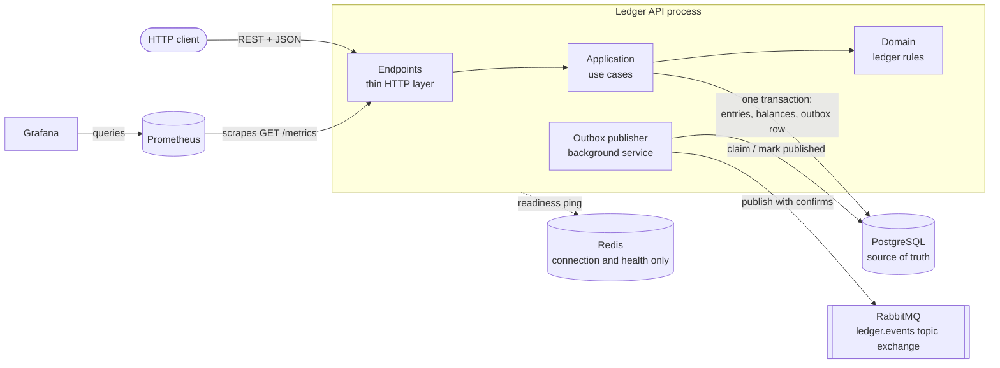
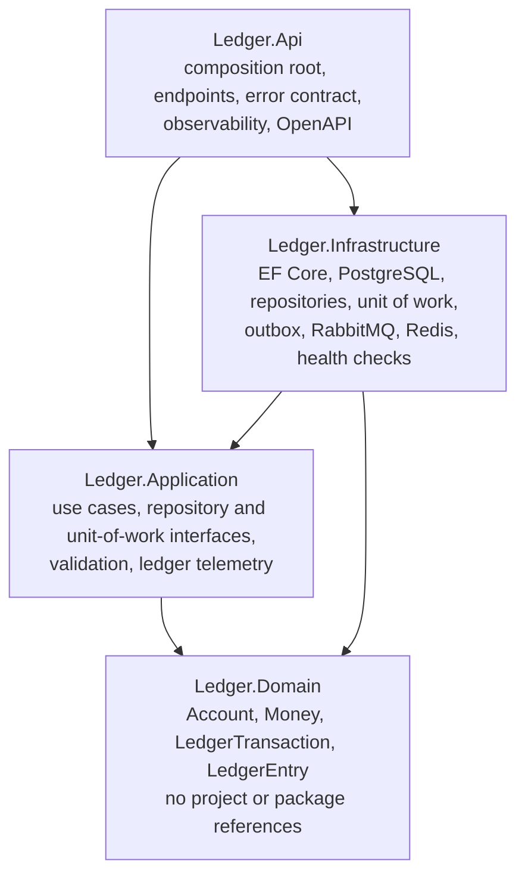
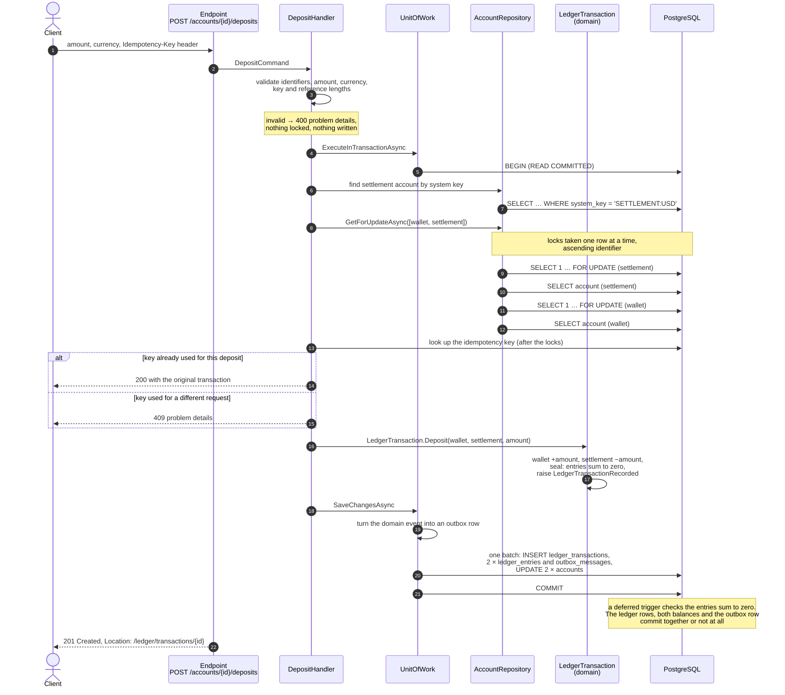
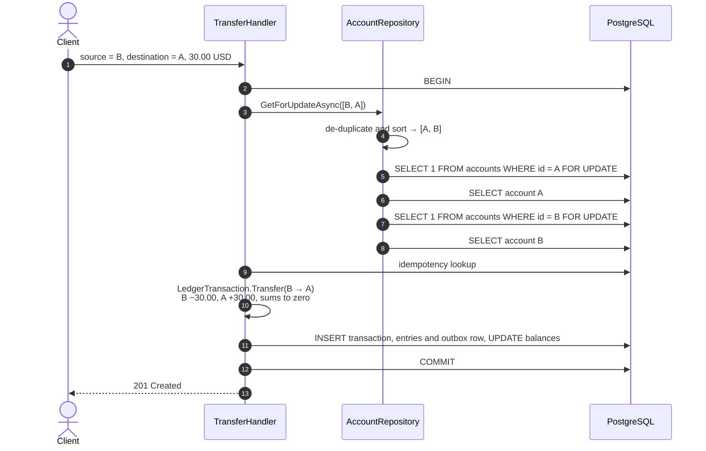
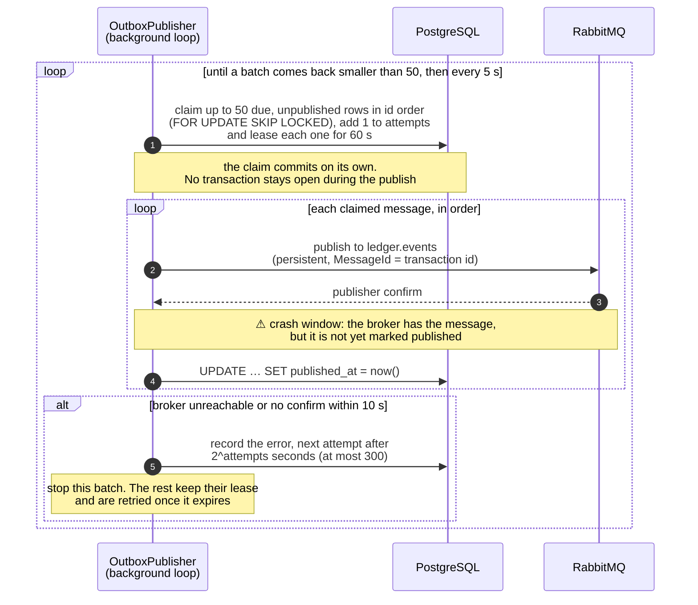
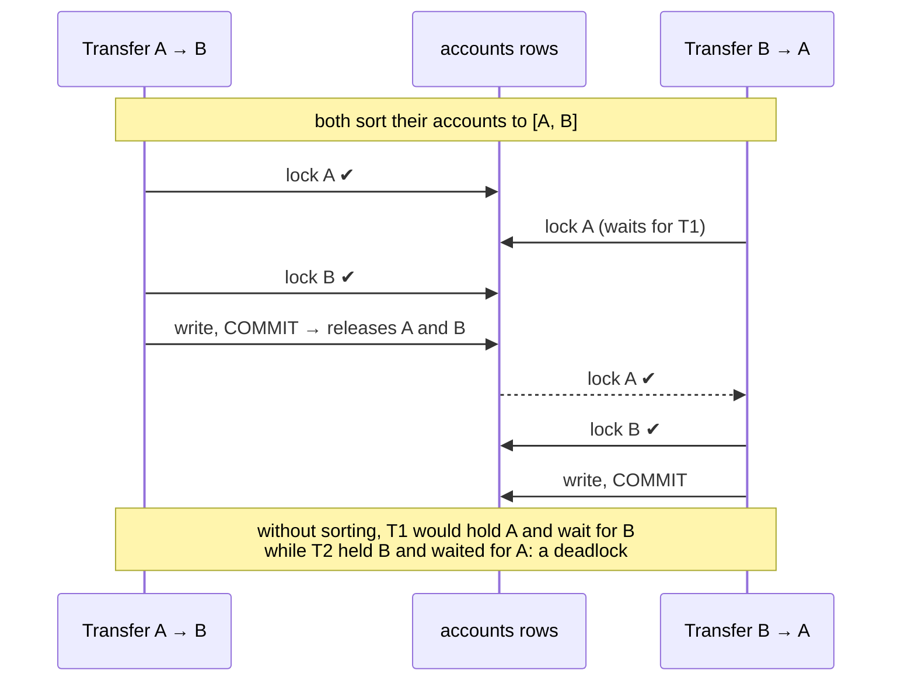
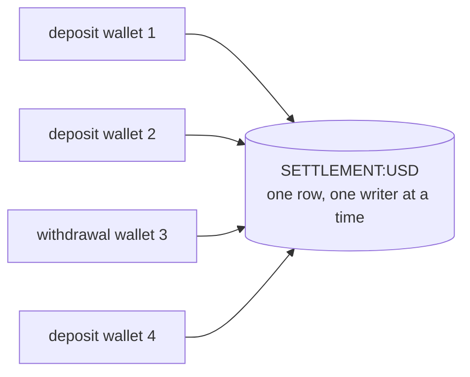

# Architecture

How the service is put together, and how a request moves through it. The
diagrams are Mermaid, so they render on GitHub and live in version control beside
the code they describe. Every step shown here is what the code does today; where
something is a limitation or not built, the text says so.

- [1. System context](#1-system-context)
- [2. Layers and dependencies](#2-layers-and-dependencies)
- [3. A deposit, end to end](#3-a-deposit-end-to-end)
- [4. A transfer and its two locks](#4-a-transfer-and-its-two-locks)
- [5. Publishing from the outbox](#5-publishing-from-the-outbox)
- [6. Why lock ordering prevents deadlocks, and what it cannot fix](#6-why-lock-ordering-prevents-deadlocks-and-what-it-cannot-fix)
- [7. What is the source of truth](#7-what-is-the-source-of-truth)

## 1. System context

| Component | Role | If it is unavailable |
|---|---|---|
| PostgreSQL | Every account, balance, ledger entry, idempotency key and outbox message. The only source of truth. | Requests that need data fail with 500; readiness returns 503. See [FAILURES.md](FAILURES.md). |
| RabbitMQ | Receives `ledger.transaction.recorded.v1` events published from the outbox. Not part of any financial transaction. | Money keeps moving; events wait in the outbox; readiness reports `Degraded` with 200. |
| Redis | Provisioned and health-checked. **Nothing reads or writes it.** | Readiness reports `Degraded` with 200. Nothing else changes. |
| Prometheus, Grafana | Scrape and display the API's metrics. | The API is unaffected. |

## 2. Layers and dependencies

Dependencies point inwards. `Ledger.Domain` references nothing, so a change to
the database, the ORM or the web framework cannot alter a ledger rule, and the
rules are tested without any of them. `Ledger.Application` declares the
interfaces it needs (`IAccountRepository`, `ILedgerTransactionRepository`,
`IUnitOfWork`); `Ledger.Infrastructure` implements them with `internal` classes,
so EF Core is invisible outside that project. `Ledger.Api` is the only project
that knows all of them exist. See ADR-002 and ADR-003 in
[DECISIONS.md](DECISIONS.md).

## 3. A deposit, end to end

Points worth drawing out:

- **The outbox row is in the same transaction as the money.** There is no moment
  at which the balance has changed and the event has not been recorded, or the
  reverse. Publishing happens later and separately (section 5).
- **Locks come before reads.** Every balance the decision depends on is read after
  its row is locked, so nothing can change it between the check and the write.
- **The idempotency lookup comes after the locks.** Two requests with the same key
  and the same accounts queue on those locks, and the second sees the first one's
  committed transaction. The unique index on the key is the backstop.
- **Nine round trips, six while the settlement row is held.** EF Core's automatic
  savepoint around `SaveChanges` is disabled because it added two more inside the
  locked window and served no purpose here (PERFORMANCE.md, section 8.3).

A withdrawal is the mirror image, with one more rule: the wallet must hold the
amount, or the domain refuses with `InsufficientFundsException` (422) and the
transaction rolls back.

## 4. A transfer and its two locks

The locks are taken in identifier order, **not** in source-then-destination order.
A transfer from B to A and a transfer from A to B therefore both lock A first, so
they queue instead of deadlocking. No settlement account is involved, which is why
transfers spread across many wallets scale far better than deposits
(PERFORMANCE.md, section 7.1).

## 5. Publishing from the outbox

**Delivery is at-least-once, never exactly-once.** If the process dies between the
broker's confirmation and the `published_at` update, the row is still pending; once
its 60-second lease expires another claim picks it up and publishes it again. The
duplicate is unavoidable, because the broker and the database cannot commit
together. Every message therefore carries a stable `MessageId` equal to the ledger
transaction identifier, and a consumer must de-duplicate on it. A crash **before**
publishing produces no duplicate: the lease expires and the message is simply
published late.

What the design guarantees instead: a committed transaction always has exactly one
outbox row, a broker outage never rolls back money, and nothing confirmed by the
broker is lost. Phase 6 verified all three under load, including an end-to-end
audit queue that received 16,339 messages for 16,338 published (PERFORMANCE.md,
section 11). Several API instances may run the publisher at once: `SKIP LOCKED`
plus the lease keeps two of them from publishing the same row at the same time.

Nothing in this repository consumes the events; the exchange exists for other
services to bind to.

## 6. Why lock ordering prevents deadlocks, and what it cannot fix

A deadlock needs a cycle: each transaction holding a row the other wants. If every
transaction acquires its rows in one global order, no cycle can form, so no
deadlock can occur — not "rarely", but never. Phase 6 recorded zero deadlocks
across every stack and every scenario, including transfers in both directions
between the same two wallets.

What ordering cannot fix is **contention**. Every deposit and withdrawal in a
currency must lock that currency's single settlement account, so they all queue on
one row:

That row is the measured throughput ceiling for deposits and withdrawals in one
currency — about 165 a second on the reference laptop — and it is accepted
deliberately. The details, the rejected alternative of locking it last, and the
future option of sharding it are in [CONCURRENCY.md](CONCURRENCY.md) and ADR-010.

## 7. What is the source of truth

| Data | Kind | Where it lives |
|---|---|---|
| Ledger entries | **Source of truth.** The historical record of every movement; append-only. | `ledger_entries` |
| Ledger transactions | Source of truth. Groups entries, carries the idempotency key and any reversal link. | `ledger_transactions` |
| Account balance | **Derived state**, materialised. Always written in the same transaction as the entries that change it, and must equal their sum. | `accounts.balance_amount` |
| Outbox messages | Durable record of events to publish, committed with the money. | `outbox_messages` |
| Events on RabbitMQ | Asynchronous notification, delivered at least once. Never authoritative. | `ledger.events` exchange |
| Metrics, logs, traces | Observability only. No amounts, no balances in metrics or logs. | Prometheus, stdout |
| Redis | Nothing. | — |
